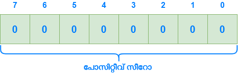

## ബിറ്റ്‌വൈസ് നോട്ട് പ്രവര്‍ത്തിക്കുന്നതെങ്ങനെ?

ബിറ്റ്‌വൈസ് നോട്ടിനെക്കുറിച്ച് ചര്‍ച്ച ചെയ്തപ്പോള്‍ ബോധപൂര്‍വം ചര്‍ച്ച ചെയ്യാതെ വിട്ട കുറച്ചു കാര്യങ്ങളെക്കുറിച്ചാണ് ഈയൊരു ഭാഗത്ത് ചര്‍ച്ച ചെയ്യുന്നത്. ബിറ്റ്‌വൈസ് നോട്ടിന്റെ പ്രവര്‍ത്തനത്തെക്കുറിച്ച് ചര്‍ച്ച ചെയ്യുന്നതിന് മുമ്പ് മറ്റ് ചില കാര്യങ്ങള്‍ കൂടെ ചര്‍ച്ച ചെയ്യേണ്ടത് അനിവാര്യമാണ്. നമുക്കറിയാം പോസിറ്റീവ് സംഖ്യകള്‍ പോലെ തന്നെ വളരെ പ്രധാനപ്പെട്ടതാണ് നെഗറ്റീവ് സംഖ്യകളും. നമ്മള്‍ നെഗറ്റീവ് സംഖ്യകള്‍ എങ്ങനെ പ്രതിനിധീകരിക്കാം എന്നുള്ളത് ഇതേ വരെ ചര്‍ച്ച ചെയ്തിട്ടില്ല. അത് അറിഞ്ഞാല്‍ മാത്രമാണ് നമുക്ക് ബിറ്റ്‌വൈസ് നോട്ട് നമ്മള്‍ പ്രതീക്ഷിക്കാത്ത ഔട്ട്പുട്ട് നല്കുന്നു എന്നു മനസ്സിലാക്കാന്‍ ആകൂ.

### സൈന്‍ഡ് മാഗ്നിറ്റ്യൂഡ് റെപ്രെസെന്റേഷന്‍

സൈന്‍ഡ് മാഗ്നിറ്റ്യൂഡ് റെപ്രെസെന്റേഷന്‍ ഉപയോഗിച്ച് ഒരു നമ്പറിനെ ഏറ്റവും എളുപ്പത്തില്‍ എങ്ങനെ പോസിറ്റീവ് ആയും നെഗറ്റീവ് ആയും പ്രതിനിധീകരിക്കാം. ഇവിടെ മോസ്റ്റ് സിഗ്നിഫിക്കന്‍റ് ബിറ്റ് 0 ആണെങ്കില്‍ ഒരു സംഖ്യ  പോസിറ്റീവ് ആണെന്നും 1 ആണെണെങ്കില്‍ ആ സംഖ്യ നെഗറ്റീവ് ആണെന്നും കൂടാതെ ബാക്കിയുള്ള ബിറ്റുകള്‍ സംഖ്യയുടെ പരിമാണം അഥവാ മാഗ്നിറ്റ്യൂഡ് തീരുമാനിക്കുന്നു എന്നാണ് സൈന്‍ഡ് മാഗ്നിറ്റ്യൂഡ് റെപ്രെസെന്റേഷന്‍ പറയുന്നത്.

പക്ഷേ ഇവിടെ ഒരു പ്രശ്നം ഒളിഞ്ഞിരിക്കുന്നുണ്ട്. \\(0_{10}\\) എന്നുള്ളത് എനിക്ക് രണ്ട് രീതിയില്‍ എഴുതാം.

പോസിറ്റീവ് 0-യും നെഗറ്റീവ് 0-ഉം തമ്മിലുള്ള വിത്യാസം ഒരു സോഫ്റ്റ്‌വെയർ എഞ്ചിനീയറെ സംബദ്ധിച്ച് എളുപ്പത്തില്‍ പരിശോധിക്കാവുന്ന കാര്യമാണ്. എന്നാല്‍ ഹാർഡ്‍വെയർ എഞ്ചിനീയറെ സംബദ്ധിച്ച് ഡിജിറ്റല്‍ സര്‍ക്യൂട്ട് സങ്കീര്‍ണമാകുന്നതനുസരിച്ച് പോസിറ്റീവ്/ നെഗറ്റീവ് 0 എന്ന ആശയം പ്രതിസന്ധികള്‍ സൃഷ്ടിക്കും. അതിനാല്‍ തന്നെ സൈന്‍ഡ് മാഗ്നിറ്റ്യൂഡ് റെപ്രെസെന്റേഷന് ബദല്‍ ആവശ്യമാണ്.

* \\(n\\)-ബിറ്റുകള്‍ ഉപയോഗിച്ച് നമുക്ക് \\(-(2^{n} - 1)\\) മുതല്‍ \\(2^{n}-1\\) വരെയുള്ള സംഖ്യകള്‍ സൈന്‍ഡ് മാഗ്നിറ്റ്യൂഡ് റെപ്രെസെന്റേഷന്‍ ഉപയോഗിച്ച് നിര്‍മിക്കാം.

### വണ്‍സ് (1's) കോംപ്ലിമെന്റ്

വണ്‍സ് കോംപ്ലിമെന്റ് എന്നുദ്ദേശിക്കുന്നത് ഒരു ബൈനറി നമ്പറിലെ ഓരോ ബിറ്റും ഇന്‍വെര്‍ട് ചെയ്തതാണ്. അതായത് ഒരു ബിറ്റ് 1 ആയിരുന്നു എങ്കില്‍ തല്‍സ്ഥാനത്തെ ബിറ്റ് 0 ആകും 0 ആയിരുന്നു എങ്കില്‍ ആ സ്ഥാനത്തെ ബിറ്റ് 1 ആകും.

അപ്പോള്‍ നമുക്ക് \\(10_{10} = 1010_{2}\\) എന്ന സംഖ്യ പരിശോധിക്കാം.

\\[
	\begin{array}{|c|c|c|c|c|c|}
        \hline
            10_{10} & \rightarrow & 1 & 0 & 1 & 0 \\\\
            \hline
            \downarrow &  & \downarrow & \downarrow & \downarrow & \downarrow \\\\
            \hline
            \sim10_{10} & \rightarrow & 0 & 1 & 0 & 1 \\\\
            \hline
        \hline
    \end{array}
\\]

#### സൈന്‍ഡ് വണ്‍സ് കോംപ്ലിമെന്റ്

നമ്മള്‍ മുകളില്‍ \\(10_{10}\\)-ന്റെ വണ്‍സ് കോംപ്ലിമെന്റ് ആണ് മുകളില്‍ എഴുതിയിരിക്കുന്നത്. എന്നാല്‍ 4 ബിറ്റ് ഉപയോഗിച്ച് നമുക്ക് \\(10_{10}\\)-ന്റെ സൈന്‍ഡ് വണ്‍സ് കോംപ്ലിമെന്റ് എഴുതാന്‍ ആകില്ല. \\(n\\)-ബിറ്റുകള്‍ ഉപയോഗിച്ച് നമുക്ക് \\(-(2^{n} - 1)\\) മുതല്‍ \\(2^{n}-1\\) വരെയുള്ള സംഖ്യകള്‍ സൈന്‍ഡ് വണ്‍സ് കോംപ്ലിമെന്റ് ഉപയോഗിച്ച് നിര്‍മിക്കാം.

* സൈന്‍ഡ് മാഗ്നിറ്റ്യൂഡ് റെപ്രെസെന്റേഷനിലേത് പോലെ തന്നെ ഇവിടെയും മോസ്റ്റ് സിഗ്നിഫിക്കന്റ് ബിറ്റ് 1 ആണെങ്കില്‍ സംഖ്യ നെഗറ്റീവ് ആയിരിയ്ക്കും 0 ആണെങ്കില്‍ പോസിറ്റീവും.

ഉദാഹരണമായി \\(0101_{2}\\) അഥവാ \\(5_{10}\\) എന്ന സംഖ്യ പരിഗണിക്കുക. ഈ സംഖ്യ പോസിറ്റീവ് ആണ്. ഈ സംഖ്യയുടെ വണ്‍സ് കോംപ്ലിമെന്റ് എന്നു പറയുന്നത് ആണ് സൈന്‍ഡ് വണ്‍സ് കോംപ്ലിമെന്റ് റെപ്രെസെന്റേഷന്‍ പ്രകാരം \\(0101_{2}\\)-ന്റെ വണ്‍സ് കോംപ്ലിമെന്റ് ആയ \\(1010_{2}\\) ആണ് \\(-5_{10}\\).

\\[
	\begin{array}{|c|c|c|c|c|c|c|c|}
        \hline
            5_{10} & \rightarrow & 0 & 1 & 0 & 1 & \rightarrow & +5_{10} \\\\
            \hline
            \downarrow &  & \downarrow & \downarrow & \downarrow & \downarrow \\\\
            \hline
            \sim5_{10} & \rightarrow & 1 & 0 & 1 & 0 & \rightarrow & -5_{10} \\\\
            \hline
        \hline
    \end{array}
\\]

പക്ഷേ ഇവിടെയും പ്രശ്നം പരിഹരിക്കപ്പെടുന്നില്ല. സൈന്‍ഡ് വണ്‍സ് കോംപ്ലിമെന്റ് റെപ്രെസെന്റേഷനിലും പൂജ്യത്തിന് രണ്ട് റെപ്രെസെന്‍റേഷന്‍ ഉണ്ട്. അതായത് \\(0000_{2}\\) എന്നത് പോസിറ്റീവ് പൂജ്യമാണെങ്കില്‍ \\(1111_{2}\\) എന്നത് നെഗറ്റീവ് പൂജ്യമാണ്..

### ടൂസ് (2's) കോംപ്ലിമെന്റ് മെത്തേഡ്

വണ്‍സ് കോംപ്ലിമെന്റിനോട് ഒന്ന് കൂട്ടിയതാണ് ടൂസ് കോംപ്ലിമെന്റ്. ഉദാഹരണമായി \\(10_{10} = 1010_{2}\\) എന്ന സംഖ്യ പരിശോധിക്കാം. ഈ സംഖ്യയുടെ ടൂസ് കോംപ്ലിമെന്റ് ചുവടെ കാണുന്ന രീതിയില്‍ നമുക്ക് കണ്ടെത്താവുന്നതാണ്.

\\[
	\begin{array}{|c|c|c|c|c|c|c|}
        \hline
            10_{10} & \rightarrow & 1 & 0 & 1 & 0 & \\\\
            \hline
            \downarrow &  & \downarrow & \downarrow & \downarrow & \downarrow & \\\\
            \hline
            \sim10_{10} & \rightarrow & 0 & 1 & 0 & 1 & + \\\\
            1_{10} & \rightarrow & 0 & 0 & 0 & 1 & \\\\
            \hline
            6_{10} & \rightarrow & 0 & 1 & 1 & 0 & \\\\ 
            \hline
        \hline
    \end{array}
\\]

#### സൈന്‍ഡ് ടൂസ് കോംപ്ലിമെന്റ്

സൈന്‍ഡ് ടൂസ് കോംപ്ലിമെന്റിനെ വ്യത്യസ്തമാക്കുന്നത്, ഇവിടെ പൂജ്യത്തിന് രണ്ട് റെപ്രെസെന്റേഷന്‍ ഇല്ല എന്നുള്ളതാണ്. നിങ്ങള്‍ക്ക് എളുപ്പത്തില്‍ അതിനുള്ള കാരണം കണ്ടെത്താവുന്നതാണ്. \\(0000_{2}\\) എന്ന പൂജ്യത്തെ പ്രതിനിധീകരിക്കുന്ന 4-ബിറ്റ് പരിഗണിക്കുക. ഇതിന്റെ വണ്‍സ് കോംപ്ലിമെന്റ് എന്നു പറയുന്നത് \\(1111_{2}\\) ആണ്. ഇതിനാല്‍ തന്നെയാണ് \\(+0\\), \\(-0\\) എന്ന ആശയം സൈന്‍ഡ് വണ്‍സ് കോംപ്ലിമെന്റ് റെപ്രെസെന്റേഷനില്‍ ഉള്ളത്. എന്നാല്‍ നമ്മള്‍ പൂജ്യത്തെ വണ്‍സ് കോംപ്ലിമെന്റ് ചെയ്ത് ലഭിച്ച \\(1111_{2}\\)-നോട് ഒന്ന് കൂട്ടുമ്പോള്‍ നമുക്ക് ലഭിക്കുക \\(10000_{2}\\) എന്ന 5-ബിറ്റ് നമ്പര്‍ ആണ്. അതായത് 4-ബിറ്റ് ഉപയോഗിച്ച് \\(10000_{2}\\) സൂക്ഷിക്കാനാവില്ലാത്തതിനാല്‍ 4-ബിറ്റില്‍ \\(0000_{2}\\) ആണ് സ്റ്റോര്‍ ആകൂ. \\(10000_{2}\\)-ലെ 1 എന്നത് ഓവര്‍ഫ്ലോ ആണ്.

* ഇവിടെ \\(n\\)-ബിറ്റുകള്‍ ഉപയോഗിച്ച് നമുക്ക് \\(-2^{n}\\) മുതല്‍ \\(2^{n}-1\\) വരെയുള്ള സംഖ്യകള്‍ നിര്‍മിക്കാം. അതായത് അധികമായി ഒരു സംഖ്യ കൂടെ അധികമായി റെപ്രസെന്‍റ് ചെയ്യാനാകും.

* സൈന്‍ഡ് മാഗ്നിറ്റ്യൂഡ് റെപ്രെസെന്റേഷനിലേത് പോലെ തന്നെ ഇവിടെയും മോസ്റ്റ് സിഗ്നിഫിക്കന്റ് ബിറ്റ് 1 ആണെങ്കില്‍ സംഖ്യ നെഗറ്റീവ് ആയിരിയ്ക്കും 0 ആണെങ്കില്‍ പോസിറ്റീവും.

ചുവടെയുള്ള പട്ടികയില്‍ 4-ബിറ്റ് ഉപയോഗിച്ച് റെപ്രസെന്‍റ് ചെയ്യാവുന്ന സംഖ്യകളുടെ സൈന്‍ഡ് മാഗ്നിറ്റ്യൂഡ്, സൈന്‍ഡ് വണ്‍സ് കോംപ്ലിമെന്റ്, സൈന്‍ഡ് ടൂസ് കോംപ്ലിമെന്റ് എന്നിവ നല്കിയിരിക്കുന്നു.

|ഡെസിമല്‍|സൈന്‍ഡ് മാഗ്നിറ്റ്യൂഡ് |സൈന്‍ഡ് വണ്‍സ് കോംപ്ലിമെന്റ്|സൈന്‍ഡ് ടൂസ് കോംപ്ലിമെന്റ്|
|:-------:|:-------------:|:----------------:|:-------------:|
|\\(+7\\)|0111|0111|0111|
|\\(+6\\)|0110|0110|0110|
|\\(+5\\)|0101|0101|0101|
|\\(+4\\)|0100|0100|0100|
|\\(+3\\)|0011|0011|0011|
|\\(+2\\)|0010|0010|0010|
|\\(+1\\)|0001|0001|0001|
|\\(+0\\)|0000|0000|0000|
|\\(-0\\)|1000|1111|——|
|\\(-1\\)|1001|1110|1111|
|\\(-2\\)|1010|1101|1110|
|\\(-3\\)|1011|1100|1101|
|\\(-4\\)|1100|1011|1100|
|\\(-5\\)|1101|1010|1011|
|\\(-6\\)|1110|1001|1010|
|\\(-7\\)|1111|1000|1001|
|\\(-8\\)|——|——|1000|
