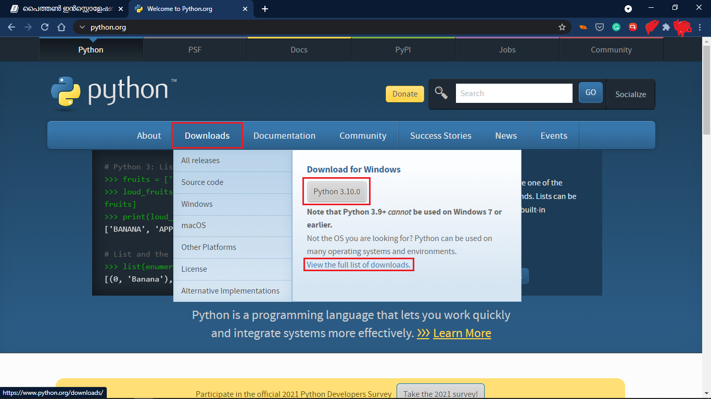
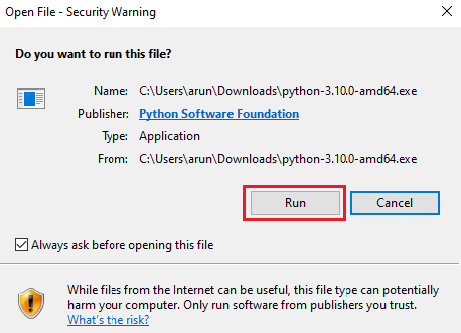
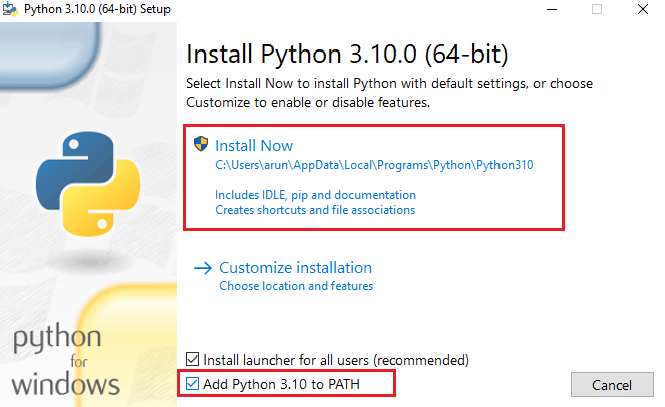

## പൈത്തണ്‍ 3 ഇന്‍സ്റ്റോളേഷന്‍

### വിന്‍ഡോസ്

വിന്‍ഡോസ് മെഷീനുകളില്‍ പൈത്തണ്‍ ഇന്‍സ്റ്റോള്‍ ചെയ്യാന്‍ വളരെ എളുപ്പമാണ്. പൈത്തന്റെ [ഒഫീഷ്യല്‍ വെബ്സൈറ്റ്](https://www.python.org/) സന്ദര്‍ശിക്കുക. ഡൌണ്‍ലോഡ്സ് (Downloads) എന്ന മെനുവില്‍ മൌസ് ഹോവര്‍ ചെയ്യുക. നിങ്ങള്‍ക്ക് അവിടെ നിന്നും ഏറ്റവും പുതിയ പൈത്തണ്‍ വേര്‍ഷന്‍ ഡൌണ്‍ലോഡ് ചെയ്യാവുന്നതാണ്. നിങ്ങള്‍ക്ക് പഴയ പൈത്തണ്‍ വേര്‍ഷന്‍ ആണ് വേണ്ടത് എങ്കില്‍ [View the full list of downloads](https://www.python.org/downloads/) എന്ന കണ്ണിയില്‍ ക്ലിക്ക് ചെയ്യുക.


ഇപ്പോള്‍ നിങ്ങള്‍ [https://www.python.org/downloads](https://www.python.org/downloads) എന്ന വെബ് പേജിലേക്ക് നീങ്ങുന്നതാണ്. അവിടെ നിന്നും നിങ്ങള്‍ക്ക് പൈത്തണ്‍ എക്സിക്യൂട്ടബിള്‍ ഡൌണ്‍ലോഡ് ചെയ്യാവുന്നതാണ്.

1. പൈത്തണ്‍ എക്സിക്യൂട്ടബിള്‍ ഡൌണ്‍ലോഡ് ചെയ്തതിന് ശേഷം ഡൌണ്‍ലോഡ്സില്‍ ഉള്ള പൈത്തണ്‍ എക്സിക്യൂട്ടബിള്‍ ഫയലില്‍ ഡബിള്‍ ക്ലിക്ക് ചെയ്യുക.

2. അപ്പോള്‍ തുറന്നു വരുന്ന റണ്‍ ഡയലോഗ് ബോക്സിലെ റണ്‍ ബട്ടണില്‍ ക്ലിക്ക് ചെയ്യുക

3. അടുത്തതായി തുറന്നുവരുന്ന ഇന്‍സ്റ്റോളേഷന്‍ സെറ്റപ്പ് വിസാര്‍ഡില്‍ `Add Python to PATH` എന്നുള്ള ചെക്ബോക്സ് ചെക്ക് ചെയ്യുക. അതിനുശേഷം മാത്രം Install Now ക്ലിക്ക് ചെയ്യുക.

4. ഇന്‍സ്റ്റോളേഷന് ശേഷം കമാന്‍ഡ് പ്രോംപ്റ്റ് തുറക്കുക. അതിന് ശേഷം ചുവടെയുള്ള കമാന്‍ഡ് അടിക്കുക:

```
python --version
```
നിങ്ങള്‍ക്ക് ലഭിക്കുന്ന ഔട്ട്പുട്ട് ചുവടെ കാണുന്ന രീതിയില്‍ നിങ്ങള്‍ ഇന്‍സ്റ്റോള്‍ ചെയ്ത വേര്‍ഷന്‍ ആണെങ്കില്‍ പൈത്തണ്‍ നിങ്ങളുടെ സിസ്റ്റത്തില്‍ വിജയകരമായി ഇന്‍സ്റ്റോള്‍ ആയിട്ടുണ്ട്.

```
Python 3.9.2
```

### ലിനക്സ് ഡിസ്ട്രിബ്യൂഷന്‍

മിക്കവാറും ലിനക്സ് ഡിസ്ട്രിബ്യൂഷനുകളില്‍ പൈത്തണ്‍ 2-ഉം പൈത്തണ്‍ 3-യും പ്രീഇന്‍സ്റ്റോള്‍ഡ് ആയിരിയ്ക്കും. നിങ്ങളുടെ സിസ്റ്റത്തില്‍ പൈത്തണ്‍ 3 ഇന്‍സ്റ്റോള്‍ ചെയ്തിട്ടുണ്ട് എന്ന് ഉറപ്പ് വരുത്താനായി

```
python3 --version
```

എന്ന കമാന്‍ഡ് ഉപയോഗിക്കുക. നിങ്ങളുടെ സിസ്റ്റത്തില്‍ ഇന്‍സ്റ്റോള്‍ ആയിരിക്കുന്ന പൈത്തണ്‍ വേര്‍ഷന്‍ ചുവടെയുള്ളത് പോലെ കാണാന്‍ ആകുന്നുണ്ട് എങ്കില്‍ പൈത്തണ്‍ സിസ്റ്റത്തില്‍ മുന്നേ ഇന്‍സ്റ്റോള്‍ ചെയ്തതാണ്.

```
Python 3.9.2
```

**`python --vesion` എന്ന കമാന്‍ഡ് വിന്‍ഡോസ് സിസ്റ്റത്തില്‍ ഉപയോഗിച്ചതിന് പകരം ഇവിടെ `python3 --vesion` എന്ന കമാന്‍ഡ് ഉപയോഗിക്കാനുള്ള കാരണം ലിനക്സ് ഡിസ്ട്രിബ്യൂഷനുകളില്‍ പൈത്തണ്‍ 2-ഉം ചിലപ്പോള്‍ പ്രീഇന്‍സ്റ്റോള്‍ ആയിരിക്കാനുള്ള സാധ്യത ഉണ്ട്. അതിനാല്‍ തന്നെ `python` എന്ന കമാന്‍ഡ് പൈത്തണ്‍ 2-വിനെയും `python3` എന്നത് പൈത്തണ്‍ 3-നെയുമാണ് സൂചിപ്പിക്കുന്നത്.**

>ലിനക്സ് ഡിസ്ട്രിബ്യൂഷനുകളില്‍ `python 3`-യ്ക്കു `python` എന്ന മറ്റൊരു പേര് കമാന്‍ഡ് ലൈനില്‍ ഉപയോഗിക്കാനായി ബാഷ് പ്രൊഫൈലില്‍ (.bashrc ഫയലില്‍) എലിയാസ് (alias) അഥവാ മറ്റൊരു പേര്‍ നിര്‍മിക്കണം. അത് ചര്‍ച്ചയ്ക്ക് പുറത്തുള്ള കാര്യമായതിനാല്‍ നിങ്ങള്‍ സ്റ്റാക്ക് ഒവേര്‍ഫ്ലോയിലെ [ഈ ചോദ്യവും ഉത്തരവും](https://stackoverflow.com/questions/35435517/creating-an-alias-for-python3) പരിശോധിയ്ക്കുക.

എന്നാല്‍ മറ്റൊരു ഔട്ട്പുട്ട് ആണ് ഈ കമാന്‍ഡ് നല്‍കുന്നത് എങ്കില്‍ നിങ്ങള്‍ക്ക്

```
sudo apt-get install python3.x
```

എന്ന കമാന്‍ഡ് ഉപയോഗിച്ച് പൈത്തണ്‍ ഇന്‍സ്റ്റോള്‍ ചെയ്യാം. **ഇവിടെ 3.x-ലെ x പ്രതിനിധീകരിക്കുന്നത് പൈത്തണ്‍ മേജര്‍ വേര്‍ഷന്‍ ആണെന്ന് ഓര്‍ക്കുക. ഉദാഹരണാമായി:

```
sudo apt-get install python3.8
```

### മാക്

ക്ഷമിയ്ക്കുക, ഞാന്‍ ഇതേ വരെ മാക് സിസ്റ്റം ഉപയോഗിച്ചിട്ടില്ല. ഉപയോഗിച്ചിട്ടുള്ളവര്‍ക്ക് ഇന്‍സ്റ്റോള്‍ ചെയ്യേണ്ടത് എങ്ങനെയെന്ന് പറയാം. നിങ്ങള്‍ക്കും ഈ എഴുത്ത് പൂര്‍ണമാക്കാന്‍ സഹകരിക്കാവുന്നതാണ്.

### ഓര്‍ത്ത് വെക്കാന്‍

> പൈത്തന്റെ ഒഫീഷ്യല്‍ വെബ്സൈറ്റില്‍ നിന്നും ഡൌണ്‍ലോഡ് ചെയ്യുന്ന ഈയൊരു പൈത്തണ്‍ സി പ്രോഗ്രാമ്മിങ് ഭാഷ ഉപയോഗിച്ച് നിര്‍മിച്ചതാണ്. ഇത് സി പൈത്തണ്‍ (CPython) എന്നാണ് അറിയപ്പെടുന്നത്. ഇതേപ്പോലെ തന്നെ മറ്റ് പ്രോഗ്രാമ്മിങ് ഭാഷകള്‍ ഉപയോഗിച്ച് നിര്‍മിച്ചിരിക്കുന്ന പൈത്തണ്‍ ഇംപ്ലിമെന്‍റേഷനുകള്‍ ഏതൊക്കെയാണെന്ന് താഴെ പട്ടികപ്പെടുത്തിയിട്ടുണ്ട്.
> 
| പ്രോഗ്രാമ്മിങ് ഭാഷ  | പൈത്തണ്‍ ഇംപ്ലിമെന്‍റേഷന്‍ |
|:----------------:|:-----------------------:|
|   സി            |  സി പൈത്തണ്‍ (CPython)|
|   ജാവ          |  ജെ പൈത്തണ്‍ (JPython) |
|   സി#           |   അയണ്‍ പൈത്തണ്‍ (Iron Python)|
|    റസ്റ്റ്          | റസ്റ്റ് പൈത്തണ്‍ (Rust Python) |